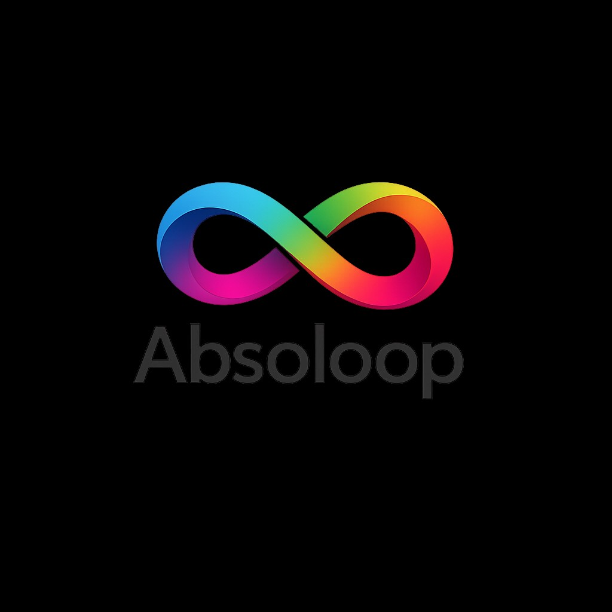
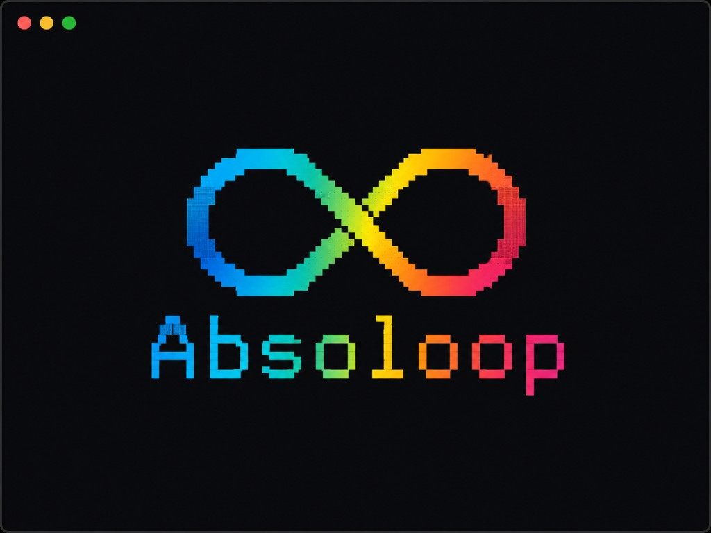

<p align="center">
  
</p>

<h1 align="center">Absoloop</h1>

<p align="center">
  <strong>Bounded, auditable AI repair loops</strong><br/>
  Evidence wins. Budgets bind. The critic does not take your word.
</p>

<p align="center">
  <a href="#quick-start">Quick start</a> ·
  <a href="docs/getting-started.md">Setup wizard</a> ·
  <a href="#how-the-loop-closes">How it works</a> ·
  <a href="#multi-provider-harness">Harness</a> ·
  <a href="CONTRIBUTING.md">Contribute</a> ·
  <a href="docs/">Docs</a>
</p>

<p align="center">
  
  
  
  
  <a href="https://github.com/BLERBZ/absoloop/actions/workflows/ci.yml"></a>
</p>

---

Absoloop is an open-source orchestrator for **local agent CLIs**. You state an
objective; Absoloop runs a checkpointed repair loop until three things agree:

1. the **builder** claims done with evidence  
2. an independent **critic** finds no blocking issue  
3. **you** approve  

No cloud Absoloop service. No mystery SaaS. Your machine, your providers,
your ledger.

```text
 objective ──► /goal contract ──► builder iterates (thinking escalates)
                                      │
                     done? ──► integrity ──► critic ──► human gate
                                      │
                               delivery: git · local · out
```

## Why Absoloop

| Principle | What it means in practice |
|---|---|
| **Evidence-gated** | Narratives and “looks good” diffs are not acceptance. |
| **Adversarial critic** | A read-only reviewer tries to *disprove* the result. |
| **Hard budgets** | Iterations, wall clock, and dollars — resume or extend anytime. |
| **Provider-native** | Grok Build, Claude Code, and Codex keep their own auth, tools, and sessions. |
| **Observable** | Live stream + `watch` + optional ZComb Kanban (`--zcomb`) + Markdown report. |
| **Stdlib-first** | Core CLI + runner: Python 3.9+, zero pip deps to install. |

<p align="center">
  
</p>

## Quick start

**Requirements:** Python 3.9+ and at least one provider CLI (`claude`, `codex`,
and/or `grok`).

```bash
git clone https://github.com/BLERBZ/absoloop.git
cd absoloop
export PATH="$PWD/bin:$PATH"       # Windows: add absoloop\bin to User PATH

absoloop setup                     # guided wizard — PATH, providers, defaults
# or just:  absoloop               # first run offers the wizard automatically
```

The wizard walks you through five short steps, then can open Mission Briefing
in the same session. Re-run anytime with `absoloop setup --force`.

```bash
absoloop doctor                    # health check anytime
absoloop "Make all tests pass"     # Mission Briefing → review card → Enter
```

**Mission Briefing keys:** `Enter` launch · `o` objective · `e` engine ·
`d` delivery · `n` rename · `g` preview `/goal` · `q` abort · `-y` skip review.

```bash
absoloop status · watch · report   # see, stream, then open the report viewer
absoloop --zcomb                   # same briefing/launch as absoloop + ZComb UI
absoloop zcomb                     # browser Kanban for a running mission
absoloop approve                   # accept at the human gate
absoloop reject "use the v2 API"   # steer the next iteration
absoloop resume · resume --extend
absoloop schedule add|tick|daemon   # cron / interval triggers (never auto-approves)
```

Runner exit codes: `0` completed · `3` awaiting your approval · `2` stopped safely.

## Multi-provider harness

Same UX, three first-class backends — isolated git worktrees, normalized
events, deterministic gates, cancelable runs:

```bash
absoloop run --provider grok "Fix the failing tests"
absoloop build --strategy race --providers grok,claude,codex "Implement #123"
absoloop review --implementer claude --reviewer codex "Harden this change"
absoloop inspect <run-id> · cancel <run-id> · apply <run-id>
```

Guides: [`docs/multi-provider.md`](docs/multi-provider.md) ·
architecture: [`docs/architecture/multi-provider-harness.md`](docs/architecture/multi-provider-harness.md) ·
config: [`absoloop.toml.example`](absoloop.toml.example).

## Shortcuts & Codex Micro

Keyboard, CLI, or a [Work Louder Codex Micro](https://worklouder.cc/codex-micro)
HID pad (defaults on F13–F24 so typing never collides):

```bash
absoloop shortcuts list · layout · listen
absoloop do status
absoloop shortcuts export --format input -o micro-input.md
```

Full guide: [`docs/shortcuts.md`](docs/shortcuts.md).

## How the loop closes

Deep dive: [`docs/mission-loop.md`](docs/mission-loop.md).

### `/goal` contract

Every mission gets a generated `.absoloop/goal.md`: objective classification
(tests / bugfix / feature / refactor / perf / docs), definition of done,
strategy ladder, and a **thinking escalation ladder** shared by the contract
and the runner.

```bash
absoloop goal · goal --regen · goal --check
```

### Skills — loopers-toolbox

Scaffolded projects receive mission skills in each engine’s native path
(`.claude/skills/`, `.codex/skills/`, `.grok/skills/`). Upstream sources include
[anthropics/skills](https://github.com/anthropics/skills),
[openai/skills](https://github.com/openai/skills),
[addyosmani/agent-skills](https://github.com/addyosmani/agent-skills),
[johnpapa/ai-ready](https://github.com/johnpapa/ai-ready),
[vercel-labs/agent-browser](https://github.com/vercel-labs/agent-browser), and
[LobeHub game-development](https://lobehub.com/skills/haniakrim21-everything-claude-code-game-development).
See `templates/skills/toolbox.json`.

### Delivery

| Mode | Result |
|---|---|
| `local` | Changes stay unstaged (default) |
| `git` | Commit to `absoloop/<loop_id>` |
| `out` | Export files + report to `~/absoloop/out/<loop_id>/` |

### Observability

```bash
absoloop watch     # live terminal dashboard (phase, budgets, activity feed)
absoloop status    # snapshot + exact next command
absoloop report    # regenerates report.md + opens lite infographic viewer
                   #   --terminal · --no-open · --md-only
```

#### ZComb Kanban UI (optional)

Browser dashboard with agent cards, Kanban board, and activity feed — vendored
from [ZComb](https://github.com/BLERBZ/zcomb). Requires **Node.js 18+**.

```bash
absoloop --zcomb                       # same briefing/launch as absoloop + Kanban
absoloop "Make all tests pass" --zcomb # objective + launch with Kanban UI
absoloop zcomb -C ./my-mission         # dashboard only (monitor a running mission)
```

On launch, opens [http://localhost:3141](http://localhost:3141) and bridges
`.absoloop/tmp/monitor.json` + `live.jsonl` into `.absoloop/zcomb/state/`.
Use `absoloop zcomb` anytime to open the dashboard without starting a mission.
Details: [`zcomb/README.md`](zcomb/README.md) · [`docs/mission-loop.md`](docs/mission-loop.md).

Telemetry lives under `.absoloop/tmp/` while running; the ledger and
`report.md` are the durable story of the mission.

## Repo layout

```text
bin/absoloop                 Public CLI
bin/absoloop_logo.py         Terminal infinity mark
absoloop_harness/            Multi-provider harness + report viewer + ZComb bridge
zcomb/                       Optional Kanban UI (vendored from BLERBZ/zcomb)
templates/absoloop-run       Reference loop runner (copied into projects)
templates/skills/            Loopers-toolbox
tests/                       Characterization + harness suites
docs/                        Guides, architecture, brand assets
.github/                     CI, issue/PR templates
```

## Contributing

Absoloop is built for people who want **honest loops** — patches welcome.

1. Read [`CONTRIBUTING.md`](CONTRIBUTING.md)  
2. Keep `bin/` + `templates/absoloop-run` **stdlib-only**  
3. Do not weaken integrity → critic → human gate  
4. Run `python3 -m unittest discover -s tests` before you push  

```bash
git clone https://github.com/BLERBZ/absoloop.git
cd absoloop && export ABSOLOOP_HOME="$PWD"
python3 -m unittest discover -s tests -v
```

Community standards: [`CODE_OF_CONDUCT.md`](CODE_OF_CONDUCT.md) ·
security reports: [`SECURITY.md`](SECURITY.md).

### Good first issues

- Docs clarifications and examples  
- Characterization tests for edge cases you’ve hit  
- Provider adapter hardening (probe / resume / cancel)  
- Report viewer and Mission Briefing UX polish  
- Shortcut catalog / Micro layout improvements  

## GitHub profile setup

A ready-to-publish org/profile README lives in
[`docs/github-profile/`](docs/github-profile/) — logos included, with
install steps for a `BLERBZ/.github` profile repo (or a personal
`username/username` profile).

## License

[MIT](LICENSE) © BLERBZ and Absoloop contributors.

Brand marks under [`docs/assets/`](docs/assets/) — see
[`docs/assets/BRAND.md`](docs/assets/BRAND.md).
