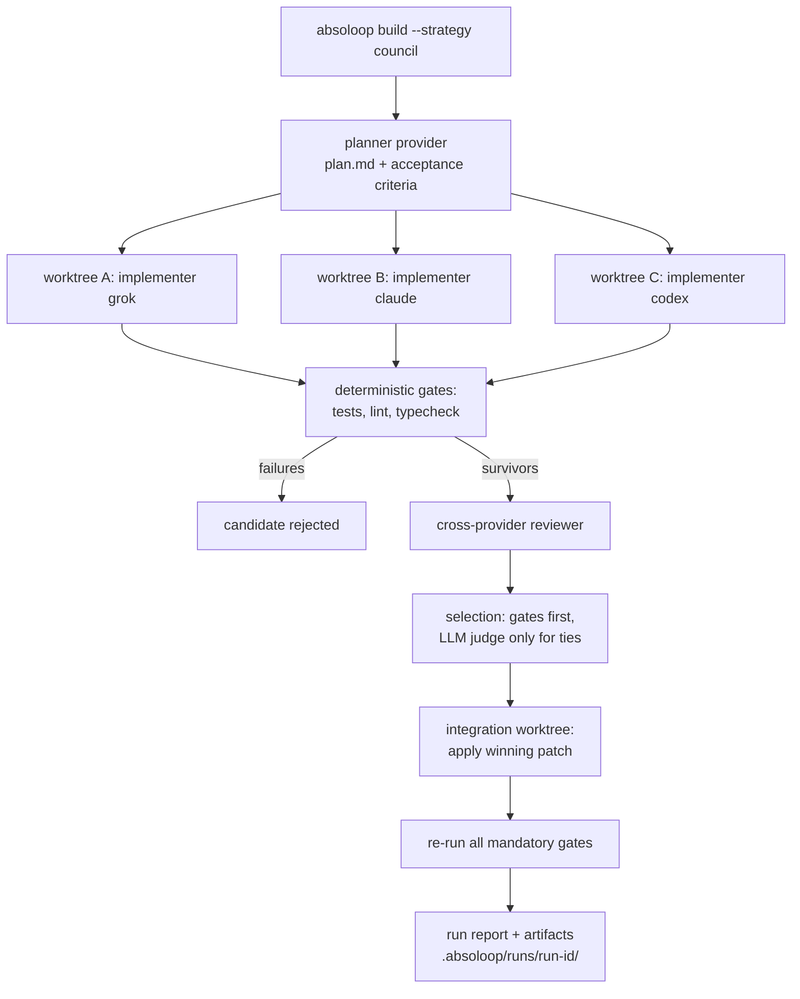

# Absoloop Multi-Provider Harness

Architecture reference for the provider-neutral harness in `absoloop_harness/`.
Operator guide: [multi-provider.md](../multi-provider.md). Mission loop
contract: [mission-loop.md](../mission-loop.md).

Absoloop's mission loop and harness both run **Grok Build, Claude Code, and
Codex** as first-class backends — preserving each agent's native
authentication, tools, sessions, permissions, sandboxing, and streaming. The
mission runner lives in `templates/absoloop-run`; the harness generalizes
one-shot / race / council flows into a provider-neutral local agent OS.

**Two-layer teams:** Absoloop owns outer orchestration (builder/critic, or
race/council lanes). Each provider process is configured and prompted to use
its own inner Agent Teams / subagents (`CLAUDE_CODE_EXPERIMENTAL_AGENT_TEAMS`
injected for Claude; Codex and Grok via prompt posture). Process-group kill
on cancel still reaps provider-spawned grandchildren.

This is **agent-runtime integration, not model-provider switching**: each
provider is its own CLI subprocess with its own auth, tools, and session
store. Absoloop never points one CLI at another vendor's model endpoint.

## Package layout

The harness is a pure-stdlib Python package, `absoloop_harness/`, mirroring
the boundaries the design calls for (the repo is Python, not the Grok Build
Rust workspace, so "crates" become modules):

| Prompt boundary | Module | Contents |
|---|---|---|
| `absoloop-core` | `absoloop_harness/core.py` | `AgentRequest`, `AgentEvent`, `EventType`, `ProviderInfo`, `ProviderCapabilities`, `SessionRef`, `RunResult`, `PermissionProfile`, redaction |
| `absoloop-process` | `absoloop_harness/process.py` | argv-only spawn, stdout/stderr separation, incremental JSONL decode, wall-clock timeout, cancellation (process-group kill), env allowlisting |
| `provider-grok` | `absoloop_harness/providers/grok.py` | Grok Build headless adapter (`--output-format streaming-json`) |
| `provider-claude` | `absoloop_harness/providers/claude.py` | Claude Code adapter (`-p --output-format stream-json --verbose`) |
| `provider-codex` | `absoloop_harness/providers/codex.py` | Codex adapter (`codex exec --json`, prompt over stdin) |
| `absoloop-workspace` | `absoloop_harness/workspace.py` | git worktrees, run directories, manifests, diff/patch export & apply, cleanup |
| `absoloop-orchestrator` | `absoloop_harness/orchestrator.py` | `single`, `review`, `race`, `council` workflows; deterministic gates |
| `absoloop-cli` | `absoloop_harness/cli.py` + `bin/absoloop` | `doctor`, `providers`, `run`, `build`, `review`, `resume`, `inspect`, `apply`, `config` |
| configuration | `absoloop_harness/config.py` | `absoloop.toml` project/user/CLI precedence with source tracking |

The legacy mission loop (`bin/absoloop` scaffold flow, `templates/absoloop-run`)
is untouched and covered by characterization tests in
`tests/test_characterization_*.py`. New harness subcommands are routed from
`bin/absoloop` before the legacy scaffolding parser, so `absoloop status`,
`absoloop watch`, `absoloop approve`, etc. behave exactly as before.

## Adapter contract

Every provider implements `ProviderAdapter` (`absoloop_harness/providers/base.py`):

```python
probe() -> ProviderProbe                     # path, version, auth hint, capabilities
start(AgentRequest) -> Iterator[AgentEvent]  # spawn + normalized stream
resume(SessionRef, AgentRequest) -> Iterator[AgentEvent]
cancel(run_id) -> None                       # kills the whole process group
normalize(raw: dict) -> list[AgentEvent]     # provider event -> neutral events
```

Rules every adapter obeys:

1. Executable + version detected at probe time; nothing is assumed.
2. Capabilities are a matrix (`ProviderCapabilities`), not implied parity.
3. Commands are argv arrays; **never `sh -c`**, never task text interpolated
   into a shell string.
4. Streaming output is parsed line-by-line and unknown events are preserved
   as `EventType.UNKNOWN` (opaque payload) for forward compatibility.
5. stderr stays separate from machine-readable stdout and is archived to
   `stderr.log`.
6. The native session/thread id is captured into `SessionRef` so a later
   `absoloop resume <run-id>` maps back to `--resume` / `-r` / `resume`.
7. Absoloop permission profiles map to the *safest* provider-native settings;
   a profile with no safe mapping **fails closed** (`PermissionMappingError`).
8. Secrets are redacted from commands, env snapshots, logs, and manifests
   (`core.redact_text` / `core.redact_env`).
9. Native auth is preserved: adapters never read, copy, or persist
   `~/.grok/auth.json`, `~/.claude`, or `~/.codex` credentials; they only
   pass through an allowlisted environment.

## Normalized event model

```python
class EventType(str, Enum):
    RUN_STARTED, TEXT_DELTA, PROGRESS,      # PROGRESS = provider-supplied reasoning *summary*
    TOOL_STARTED, TOOL_COMPLETED, FILE_CHANGED,
    APPROVAL_REQUESTED, USAGE, RUN_COMPLETED, RUN_FAILED, UNKNOWN
```

Hidden chain-of-thought is never required or displayed; `PROGRESS` carries
only provider-supplied summaries (Grok `thought`, Codex `reasoning` summary,
Claude visible text designated as progress).

### Transport → event mapping

| Neutral event | Grok (`streaming-json`) | Claude (`stream-json`) | Codex (`--json`) |
|---|---|---|---|
| RUN_STARTED | first event (synth) | `system/init` | `thread.started` |
| TEXT_DELTA | `text` | `assistant` text block | `item.completed: agent_message` |
| PROGRESS | `thought` | — | `item.completed: reasoning` |
| TOOL_STARTED | — (not emitted) | `assistant` `tool_use` block | `item.started: command_execution` |
| TOOL_COMPLETED | — | `user` `tool_result` block | `item.completed: command_execution` |
| FILE_CHANGED | — | Edit/Write tool_use (derived) | `item.completed: file_change` |
| USAGE | `end.usage` | `result.usage` | `turn.completed.usage` |
| RUN_COMPLETED | `end` | `result` (`is_error: false`) | process exit 0 |
| RUN_FAILED | `error` | `result` (`is_error: true`) | `error` / non-zero exit |
| UNKNOWN | any other `type` | any other `type` | any other `type` |

Session ids: Grok `end.sessionId` / `json.sessionId`; Claude `session_id` on
`system/init` and `result`; Codex `thread.started.thread_id`.

### Baseline transports

- **Grok**: `grok --prompt-file <f> --output-format streaming-json --cwd <wt>`
  with `--permission-mode`/`--allow`/`--deny`/`--tools` per profile; resume
  via `-r <sessionId>`. `--prompt-file` is preferred for long prompts.
- **Claude Code**: `claude -p --output-format stream-json --verbose
  --permission-mode <m> --max-turns <n>` (prompt over stdin);
  resume via `--resume <session_id>`.
- **Codex**: `codex exec --json --sandbox <s> --cd <wt> -` (prompt over
  stdin); resume via `codex exec resume <thread_id>`.

The transport boundary lives entirely inside each adapter, so Grok ACP, the
Claude Agent SDK, and the Codex app-server can replace CLI spawning later
without touching orchestration code.

## Capability matrix (static baseline, refined by probe)

| Capability | grok | claude | codex |
|---|---|---|---|
| streaming JSON | yes | yes | yes |
| session resume | yes | yes | yes |
| structured output | yes (`--output-format json`) | yes (`--output-schema`) | yes (`--output-schema`) |
| permission modes | yes (`--permission-mode`, rules) | yes (`--permission-mode`) | sandbox levels |
| native sandbox | yes (`--sandbox`) | no (relies on permission modes) | yes (`--sandbox`) |
| turn limit | yes (`--max-turns`) | yes (`--max-turns`) | no |
| prompt via stdin | no (`--prompt-file`) | yes | yes |
| cost reporting | yes (`total_cost_usd`, may be partial) | yes (`total_cost_usd`) | tokens only |

## Permission profiles

`absoloop.toml` profiles → provider-native settings; unmappable = fail closed:

| Profile | grok | claude | codex |
|---|---|---|---|
| `read` | `--tools read_file,grep,list_dir` + default permission mode | `--permission-mode plan` | `--sandbox read-only` |
| `edit` | `--allow Edit --allow Write --deny Bash(sudo*)` | `--permission-mode acceptEdits` | `--sandbox workspace-write` |
| `full` | `--yolo` | `--permission-mode bypassPermissions` | `--sandbox danger-full-access` |

`full` is never the default; workflows default to `edit`.

## Workspace and run model

One writer per worktree, always. Run artifacts:

```text
.absoloop/runs/<run-id>/
  manifest.json          # provider, version, capabilities, timestamps, session id,
                         # prompt hash, permission profile, exit status, usage,
                         # artifact paths, git diff hash — never credentials
  live.json              # orchestrator pid + active child pid/pgid (while running)
  cancel.requested       # written by `absoloop cancel` for cross-terminal stop
  events.jsonl           # normalized AgentEvent stream (redacted)
  plan.md                # council/build planner output
  summary.md             # final run report
  candidates/<provider>/
    final.json           # normalized RunResult
    diff.patch           # exported patch from the candidate worktree
    test.log             # deterministic gate output
    stderr.log           # provider stderr (redacted)
.absoloop/worktrees/<run-id>/<provider-or-role>/   # isolated candidate trees
```

Worktrees are created with `git worktree add --detach`; patches are exported
(`git add -A -N` + `git diff HEAD --binary`) before cleanup; `--keep-worktrees`
retains them for debugging.

## Workflows

- **single** — one provider executes in one worktree; gates run; patch exported.
- **review** — implementer runs; a *different* provider reviews the patch
  read-only; verified findings go back to the implementer (session resume)
  for a fix pass; gates re-run.
- **race** — N providers implement independently in isolated worktrees;
  deterministic gates (repo-native tests/lint/typecheck from config) rank
  candidates; ties broken by fewest gate failures → smallest diff; an LLM
  judge is only a configured, optional tie-breaker.
- **council** — planner → parallel implementers → reviewer/verifier →
  integrator applying the winning patch in an integration worktree, then
  all mandatory gates re-run.

Deterministic gates always run before any LLM judging. Candidates failing a
mandatory gate are rejected regardless of subjective quality.



## Security model

- **No shell interpolation** — argv arrays only; hostile prompt text and
  paths are inert (covered by command-construction tests).
- **Env allowlist** — child processes get a minimal environment: PATH, HOME,
  locale/terminal vars, and per-provider allowlisted extras from config.
  Nothing else leaks; nothing is persisted.
- **Credential isolation** — provider CLIs read their own auth stores from
  `HOME`; Absoloop never copies or persists credential files, and manifests
  store no environment dumps.
- **Redaction** — values of env vars matching secret-name patterns plus
  literal token patterns (`sk-…`, `xai-…`, `ghp_…`, bearer headers, etc.)
  are replaced with `[REDACTED]` in events, logs, and manifests.
- **Fail-closed permissions** — an unknown or unmappable profile raises
  before any process is spawned.
- **Cancellation** — providers run in their own process group/session
  (`start_new_session=True`). In-process `adapter.cancel(run_id)` and
  cross-terminal `absoloop cancel <run-id>` both work: the latter writes
  `cancel.requested`, SIGTERM/SIGKILL's every pid/pgid recorded in
  `live.json`, signals the orchestrator, and finalizes
  `status: cancelled` in the manifest even if the original process dies
  mid-write. The process watchdog also polls the cancel flag (and no
  longer busy-loops — a prior unreachable `sleep` was fixed).

## Configuration

`absoloop.toml` (project root), `~/.absoloop/absoloop.toml` (user), CLI flags
override both. Python 3.9 lacks `tomllib`, so the harness ships a minimal
TOML-subset reader (tables, strings, numbers, booleans, arrays) —
`absoloop_harness/toml_lite.py` — sufficient for the documented schema.

```toml
[providers.grok]
command = "grok"          # or absolute path
model = "grok-build-0.1"  # Absoloop default = best available
timeout_seconds = 1800
env_allowlist = []        # extra env vars to pass through

[providers.claude]
command = "claude"
model = "best"            # Fable 5 when available, else Opus
timeout_seconds = 1800

[providers.codex]
command = "codex"
model = "gpt-5.6-sol"
timeout_seconds = 1800

[permissions]
default_profile = "edit"

[gates]
required = ["tests"]      # gate names that must pass

[gates.commands]
tests = "python3 -m unittest discover -s tests"
lint = ""
typecheck = ""

[workflows]
planner = "claude"
reviewer = "codex"
implementers = ["grok", "claude", "codex"]

[artifacts]
keep_worktrees = false
retention_runs = 20
```

`absoloop config` prints every resolved value with its source
(`default` / `user` / `project` / `cli`).

## Testing strategy

- Golden fixtures for all three providers' stream formats
  (`tests/fixtures/*.jsonl`) driving parser tests.
- Command-construction tests with hostile prompt/path inputs.
- Fake provider executables (`tests/fakes/fake_provider.py`) exercising
  success, partial JSON, unknown events, stderr noise, non-zero exit,
  timeout, and cancellation through the real process supervisor.
- Session start/resume tests (argv construction + SessionRef mapping).
- Permission mapping + fail-closed tests.
- Worktree isolation and patch-application tests on throwaway git repos.
- Secret-redaction tests.
- race/review/council workflow tests entirely on fake providers.
- Live smoke tests are opt-in via `ABSOLOOP_LIVE_SMOKE=1` plus per-provider
  `ABSOLOOP_SMOKE_<PROVIDER>=1`; default CI never needs credentials.
